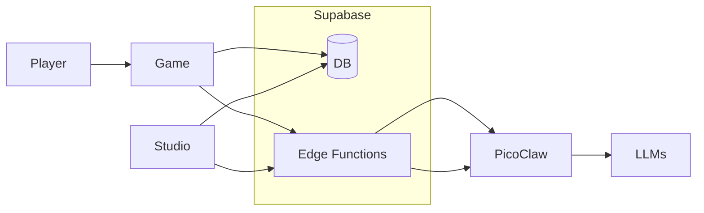

# Project Overview — Three Projects, One Stack

This repo is one product built from **three projects** that share Supabase and work together: the **game**, **Studio**, and **PicoClaw**.

---

## The Three Projects

### 1. Game (my-rpg-game)

The **RPG-JS game server** (Node.js). Runs the multiplayer browser RPG: maps, players, NPCs, and workflow objects (e.g. Mailbox, Desk). It syncs with Supabase for content (NPC definitions, object templates, player state), spawns NPCs from the database, and when a player talks to an NPC it sends the message to the **npc-ai-chat** Edge Function, which forwards to PicoClaw. The game receives the agent’s reply and shows it in the chat.

### 2. Studio (studio)

The **React admin and agent/workflow UI** (Vite, shadcn/ui). Used to create and edit AI agents, configure NPCs (spawn location, sprite, model, skills), build workflows (nodes, triggers, game actions), and manage object templates. Studio syncs with the game (e.g. game registry for maps/sprites) and with Supabase (agent configs, memory, workflows). It deploys and manages **PicoClaw** via the **picoclaw-bridge** Edge Function (deploy/stop/status, push config and workspaces).

### 3. PicoClaw (picoclaw)

The **AI agent runtime** (Go). Runs the actual NPC agents: receives chat from the game via **npc-ai-chat**, runs the LLM, skills, and tools, and returns the response. Studio configures which agents are linked to which NPCs and pushes agent/skill config to PicoClaw on deploy. Can also power studio-internal assistants (e.g. Lorekeeper).

---

## How They Connect

- **Supabase** is the shared backend: game schema (agent_configs, agent_memory, player_state, object_*), public schema (studio_*, workflows, executions), and **Edge Functions**: **object-api** (object actions), **npc-ai-chat** (player ↔ NPC chat to PicoClaw), **picoclaw-bridge** (Studio ↔ PicoClaw deploy/config).
- **Data flow:** Studio and Game read/write Supabase. Player talks to NPC → Game calls npc-ai-chat → npc-ai-chat calls PicoClaw → PicoClaw runs agent → response back to game. Studio deploys PicoClaw and pushes config via picoclaw-bridge.

---

## Run the Stack

| Component | Directory | Command | Notes |
|-----------|-----------|---------|--------|
| **Game** | `my-rpg-game/` | `npm install && npm run dev` | [README](../README.md#quick-start), [my-rpg-game/readme.md](../my-rpg-game/readme.md) |
| **Studio** | `studio/` | `npm install && npm run dev` | [studio/README.md](../studio/README.md) |
| **PicoClaw** | `picoclaw/` | Build and run binary or deploy (e.g. Railway) | [picoclaw/README.md](../picoclaw/README.md), [picoclaw/INTEGRATION.md](../picoclaw/INTEGRATION.md) |

Shared setup: Supabase project, env vars (see root [README Quick Start](../README.md#quick-start)), database migrations in `my-rpg-game/supabase/migrations/`, and Edge Function deploys from `studio/`.

---

## Repo Layout

- **my-rpg-game/** — RPG-JS game server (the game project).
- **studio/** — Studio frontend and Supabase Edge Functions (object-api, npc-ai-chat, picoclaw-bridge).
- **picoclaw/** — PicoClaw agent runtime (Go); NPC agents and optional studio assistants.
- **RPG-JS/** — Framework source (optional local reference; game depends on `@rpgjs/*` packages).
- **docs/** — Documentation (this file, implementation handoffs, guides).
- **ideas/** — Feature ideas and handoff documents.
- **docs/implementation/** — Implementation and agent task handoffs (Cursor, Lovable, Claude Code).

---

## See Also

- [README](../README.md) — Quick start, features, architecture diagram.
- [AGENTS.md](../AGENTS.md) — Build, deploy, and code conventions.
- [OBJECT-SYSTEM.md](../OBJECT-SYSTEM.md) — Workflow objects (Mailbox, Desk).
- [EDGE-FUNCTIONS.md](../EDGE-FUNCTIONS.md) — Supabase Edge Functions.
- [studio/docs/game-integration/](../studio/docs/game-integration/) — Studio–game architecture and NPC builder.
- [picoclaw/INTEGRATION.md](../picoclaw/INTEGRATION.md) — How PicoClaw is used in this repo.
