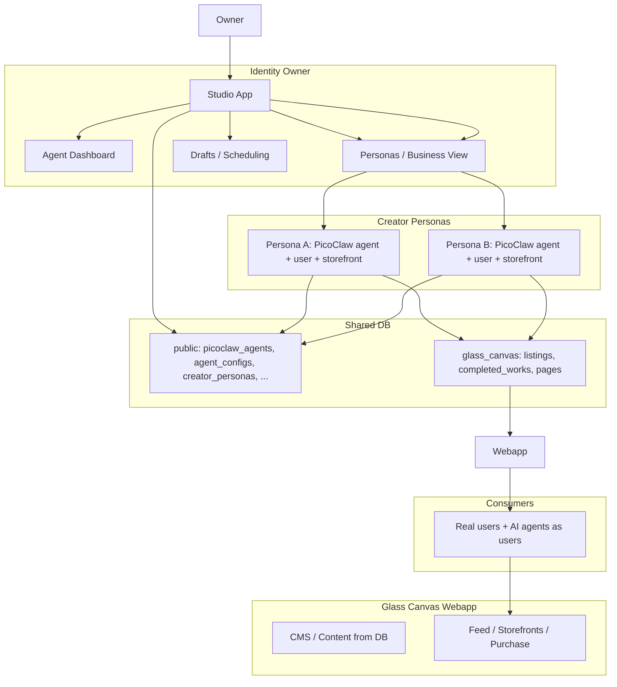

# Glass Canvas — Implementation Approach

This document summarizes the implementation approach for Glass Canvas: separate webapp (Lovable), shared DB (Studio Supabase), dedicated schema, owner controls and agent dashboard in Studio, one PicoClaw agent per creator persona, each persona with a user account, and phased rollout. **Task delegation** follows [TASK_DELEGATION.md](./TASK_DELEGATION.md): Claude Code produces sprint and task briefs; Cursor implements agent dashboard, schema design, Glass Canvas app logic, game integration; Lovable deploys Glass Canvas, runs migrations, Edge Function deployment, bug fixes.

**Idea document:** [../ideas/glass-canvas-ai-creator-personas-handoff.md](../ideas/glass-canvas-ai-creator-personas-handoff.md)

---

## Overview

- **Glass Canvas:** Separate webapp deployed on Lovable; creates/sells stained glass patterns and completed works; content driven by DB (CMS-style).
- **Database:** Same Supabase project as Studio; dedicated schema (e.g. `glass_canvas`) for listings, completed_works, pages/content; identity/persona tables in `public` or extended from auth.
- **Studio:** All Glass Canvas owner controls and **agent dashboard** live in the current Studio codebase (new routes/pages): agent-specific knowledge, tools, role, tasks, schedule, file uploads, purpose/manifesto, **Dream** (e.g. Glass Canvas).
- **Creator personas:** One identity owner → many creator personas; each persona = DB row + auth user (as if human) + one PicoClaw agent. Only identity owner sees which users are AI.
- **Auth:** Shared across Studio, Glass Canvas, and future businesses; configurable link from NPC/agent → storefront (first instance: Artel's NPC = Glass Canvas owner).

---

## Architecture

---

## Phase 1 — Agent and NPC

**Goal:** Create the agent, set up the agent dashboard in Studio (config, knowledge, tools, role, tasks, schedule, file uploads, manifesto, Dream = Glass Canvas), then place the NPC on the map so the owner can talk to them in the game.

**Implement in Studio:**

1. **Agent dashboard** — New page or extend [studio/src/pages/AgentBuilder.tsx](studio/src/pages/AgentBuilder.tsx):
   - Fields: agent-specific knowledge, tools, role, assigned tasks, schedule/routine, file upload → agent memory/knowledge (PicoClaw workspace files), purpose/manifesto, **Dream** (e.g. "Glass Canvas").
   - Persist Dream / business_id (e.g. in `picoclaw_agents` metadata or new table).

2. **Place NPC on map** — Use existing flow:
   - Link PicoClaw agent to [agent_configs](studio/src/integrations/supabase/types.ts) via `agent_config_id`; set `spawn_config` in agent_configs.
   - [my-rpg-game/main/realtime/contentSync.ts](my-rpg-game/main/realtime/contentSync.ts) and [my-rpg-game/main/services/npcSpawner.ts](my-rpg-game/main/services/npcSpawner.ts) already spawn from `agent_configs`.

**Files to create or modify:**

| Path | Action |
|------|--------|
| [studio/src/App.tsx](studio/src/App.tsx) | Add route/page for agent dashboard (or Glass Canvas owner) |
| [studio/src/pages/AgentBuilder.tsx](studio/src/pages/AgentBuilder.tsx) or new `AgentDashboard.tsx` | Agent dashboard UI: knowledge, tools, role, tasks, schedule, files, manifesto, Dream |
| [studio/src/components/agents/](studio/src/components/agents/) | New components for dashboard sections |
| [studio/supabase/functions/picoclaw-bridge/index.ts](studio/supabase/functions/picoclaw-bridge/index.ts) | Optional: include Dream or business context in workspace files |
| [studio/supabase/migrations/](studio/supabase/migrations/) | Optional: add `dream` / `business_id` to picoclaw_agents or link table |

---

## Phase 2 — Glass Canvas MVP

**Goal:** Glass Canvas schema, CMS, Lovable deploy, image generation + save to user, all backend functions wired for MVP.

1. **Schema:** Define and migrate `glass_canvas` (or equivalent) tables: listings, completed_works, pages/content for CMS. Optionally identity_owners, creator_personas (see [ideas/glass-canvas-ai-creator-personas-handoff.md](../ideas/glass-canvas-ai-creator-personas-handoff.md) Section 10).

2. **Webapp:** New codebase (separate repo or folder) connecting to same Supabase project; read/write glass_canvas schema; CMS UI or API to update content from DB.

3. **Deploy:** Deploy to Lovable.

4. **Image generation:** Use existing [studio/supabase/functions/generate-image](studio/supabase/functions/generate-image) or new Edge Function; save to storage; store references in DB (user/persona).

**Files / artifacts:**

| Path | Purpose |
|------|---------|
| [studio/supabase/migrations/](studio/supabase/migrations/) | New migration(s) for glass_canvas schema, identity_owners, creator_personas |
| New: Glass Canvas app | Frontend + API; same Supabase client, glass_canvas + public tables |
| [studio/supabase/functions/generate-image](studio/supabase/functions/generate-image) | Image gen + save; or extend for user/persona storage |

---

## Phase 3 — Post-MVP

**Goal:** List backend functions, assign to main agent vs sub-agents, manager role, in-game objects for reports and evaluations.

- **Backend function list:** Enumerate Glass Canvas (and related) backend functions; decide which the main Pico agent handles vs sub-agents (PicoClaw [spawn](picoclaw/pkg/tools/spawn.go) / [subagent](picoclaw/pkg/tools/subagent.go) allowlist).
- **Manager role:** Creator persona’s agent transitions into manager overseeing multiple agents for assigned tasks and backend functions.
- **In-game:** Player or AI-NPC goes to object for analytics report → takes to another NPC/object for evaluation/report (improvements, user journey). Use game control API pattern from [GAME_CONTROL_AND_PICOCLAW_HANDOFF.md](./GAME_CONTROL_AND_PICOCLAW_HANDOFF.md) for in-game actions.

**References:**

- [picoclaw/pkg/tools/spawn.go](picoclaw/pkg/tools/spawn.go) — async subagent
- [picoclaw/pkg/agent/loop.go](picoclaw/pkg/agent/loop.go) — subagent allowlist, tool registration
- [docs/implementation/GAME_CONTROL_AND_PICOCLAW_HANDOFF.md](./GAME_CONTROL_AND_PICOCLAW_HANDOFF.md) — game control API and PicoClaw tool

---

## Task Delegation

| Phase | Cursor | Lovable |
|-------|--------|---------|
| Phase 1 | Agent dashboard UI, new routes, Dream/business persistence, optional picoclaw-bridge workspace context | Deploy Studio changes, run migrations if any |
| Phase 2 | Schema design, migrations (author), Glass Canvas app logic, CMS, image-save flow | Deploy Glass Canvas to Lovable, run migrations, Edge Function deploy, bug fixes |
| Phase 3 | Backend function list, manager/sub-agent design, game objects and integration | Deploy game/studio updates, fix integration bugs |

**Claude Code:** Produces sprint, master plan, and task briefs from [ideas/glass-canvas-ai-creator-personas-handoff.md](../ideas/glass-canvas-ai-creator-personas-handoff.md); assigns briefs per [TASK_DELEGATION.md](./TASK_DELEGATION.md).

---

## Key File Index

| File | Purpose |
|------|---------|
| [studio/src/App.tsx](studio/src/App.tsx) | Studio routing; add agent dashboard / Glass Canvas owner page |
| [studio/src/pages/AgentBuilder.tsx](studio/src/pages/AgentBuilder.tsx) | PicoClaw agent management; extend or link to dashboard |
| [studio/src/components/agents/AgentFormModal.tsx](studio/src/components/agents/AgentFormModal.tsx) | Agent form (Identity, Soul, LLM, Skills, Memory, Game Link) |
| [studio/src/hooks/usePicoClawAgents.ts](studio/src/hooks/usePicoClawAgents.ts) | CRUD, deploy, stop, chat, skills for picoclaw_agents |
| [studio/src/integrations/supabase/types.ts](studio/src/integrations/supabase/types.ts) | DB types (picoclaw_agents, agent_configs, etc.) |
| [studio/supabase/functions/picoclaw-bridge/index.ts](studio/supabase/functions/picoclaw-bridge/index.ts) | Deploy PicoClaw config + workspace files |
| [studio/supabase/functions/npc-ai-chat/index.ts](studio/supabase/functions/npc-ai-chat/index.ts) | NPC chat; PicoClaw first, channel 'game' |
| [studio/supabase/functions/generate-image](studio/supabase/functions/generate-image) | Image generation (Gemini); extend for user/persona save |
| [studio/supabase/migrations/](studio/supabase/migrations/) | New migrations for identity_owners, creator_personas, glass_canvas |
| [my-rpg-game/main/realtime/contentSync.ts](my-rpg-game/main/realtime/contentSync.ts) | Subscribes to agent_configs; triggers spawn/despawn |
| [my-rpg-game/main/services/npcSpawner.ts](my-rpg-game/main/services/npcSpawner.ts) | Dynamic NPC class creation and spawn from agent_configs |
| [my-rpg-game/main/services/aiService.ts](my-rpg-game/main/services/aiService.ts) | Calls npc-ai-chat Edge Function for NPC dialogue |
| [my-rpg-game/main/types/npc.ts](my-rpg-game/main/types/npc.ts) | NPCConfig and related types |
| [picoclaw/pkg/agent/instance.go](picoclaw/pkg/agent/instance.go) | Agent instance; workspace, tools, memory |
| [picoclaw/pkg/agent/loop.go](picoclaw/pkg/agent/loop.go) | Agent loop; shared tools, skills, subagent allowlist |
| [picoclaw/pkg/tools/spawn.go](picoclaw/pkg/tools/spawn.go) | Async subagent spawn tool |
| [picoclaw/pkg/config/config.go](picoclaw/pkg/config/config.go) | PicoClaw config shape (agents.list, bindings, etc.) |
| [docs/implementation/TASK_DELEGATION.md](docs/implementation/TASK_DELEGATION.md) | Cursor vs Lovable vs Claude Code roles |
| [docs/implementation/GAME_CONTROL_AND_PICOCLAW_HANDOFF.md](docs/implementation/GAME_CONTROL_AND_PICOCLAW_HANDOFF.md) | Game control API; PicoClaw game_control tool |
| [ideas/glass-canvas-ai-creator-personas-handoff.md](../ideas/glass-canvas-ai-creator-personas-handoff.md) | Full idea doc: roles, phases, DB, gotchas |
