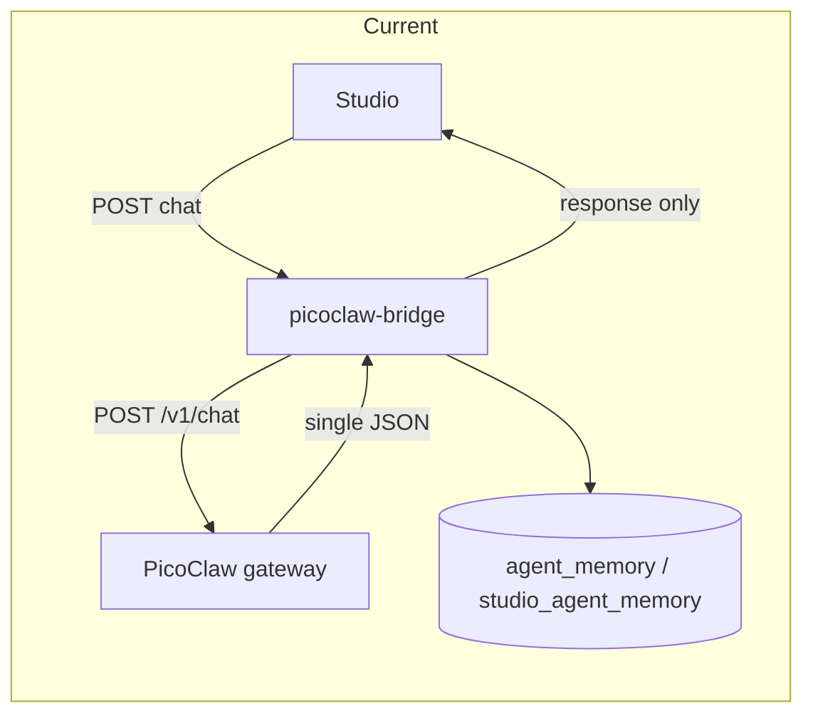
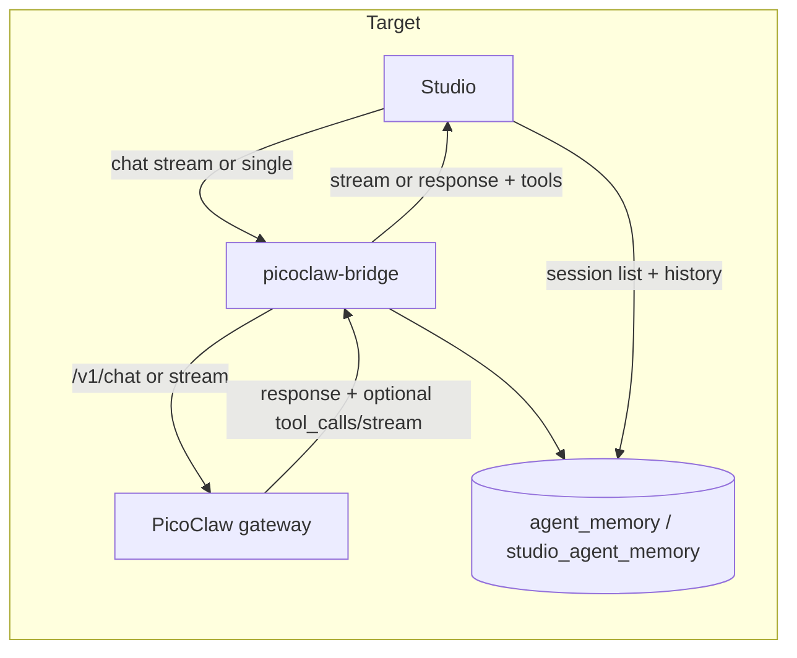

# Studio PicoClaw Alignment — OpenClaw Parity (Agents, Skills, Chat, Sessions, Usage)

> **Status:** Research complete. Ready for implementation.
> **Created:** 2026-02-20
> **Context:** Studio is PicoClaw's frontend (Agent Builder, deploy, link to NPCs, in-studio chat test). This idea aligns Studio with OpenClaw Control UI capabilities so we have everything needed to run PicoClaw effectively: chat streaming and tool visibility, session list, OpenClaw-style skills and skill library, usage/tokens where available, and gateway status.

---

## 1. The Idea

Enhance Studio so it has all the features needed to run PicoClaw effectively: chat with **streaming** and **tool-call visibility** (like OpenClaw's tool stream), a **session list** (by agent and player/game session), **OpenClaw-style skills** (YAML frontmatter + markdown body) and a **skill library** (browse, add from template or OpenClaw repo), a **usage** tab or panel for tokens/cost when that data is available, and **gateway health/status**. OpenClaw's UI and docs are the reference for feature parity.

---

## 2. Why This Matters

- **Single control plane:** Studio is the one place to manage PicoClaw agents, test chat, deploy, and link to game NPCs; parity with OpenClaw makes it complete.
- **Better debugging:** Tool-call visibility and streaming let operators see what the agent is doing in real time and troubleshoot failures.
- **Session management:** Session list and history (for game and studio agents) support support workflows and continuity.
- **Skill reuse:** OpenClaw-style SKILL.md and a skill library enable templates, sharing, and consistent skill authoring.
- **Cost visibility:** When token/cost data exists, a usage panel helps with budgeting and model choice.

---

## 3. Architecture (Current vs Target)

### Current

- **Flow:** Studio → picoclaw-bridge (Edge Function) → PicoClaw gateway `POST /v1/chat` → single JSON `{ response, session_key }`.
- **Chat:** [AgentChatTest](studio/src/components/agents/AgentChatTest.tsx) shows "Thinking…" then one reply; no streaming, no tool display.
- **Sessions:** PicoClaw keeps sessions in [session/manager.go](picoclaw/pkg/session/manager.go) (in-memory + disk); **no HTTP list or history API**. Studio/DB has `agent_memory` (game) and `studio_agent_memory` (studio) keyed by `agent_id`, `session_id`, with `role` and `content`.
- **Skills:** Stored in `picoclaw_skills` / `picoclaw_agent_skills`; bridge builds `skills/{slug}/SKILL.md` from `skill_md` on deploy.
- **Usage:** No gateway or bridge exposure of tokens/cost.

### Target (high level)

- Same flow where possible; add a **streaming path** (Studio-only Edge Function stream or new PicoClaw streaming endpoint).
- **Tool-call exposure:** Gateway or bridge returns or streams `tool_calls` / intermediate steps; Studio displays them in chat.
- **Session list:** Derived from DB (`agent_memory`, `studio_agent_memory`); load history for a session from same tables. Optional later: PicoClaw list endpoint.
- **OpenClaw-style SKILL.md + skill library:** Store/edit SKILL.md with optional YAML frontmatter; library UI to browse and add from template or import.
- **Usage panel:** When a data source exists (PicoClaw or our own tracking), Studio shows a usage tab.
- **Gateway health:** Already present; extend Studio display if gateway adds more to `/health` or admin.

---

## 4. Six Capability Areas

### Chat

- **Streaming:** Token-by-token or SSE so the user sees the reply as it’s generated (like OpenClaw).
- **Tool-call visibility:** Show which tools were called and their results (e.g. collapsible "Tool calls" in AgentChatTest).
- **Studio-only?** No. **Requires:** Either (A) Studio-only path (Edge Function streams from LLM for Studio agent chat), or (B) PicoClaw gateway streaming endpoint + agent-loop streaming.

### Sessions

- **Session list:** List sessions e.g. by agent and player/game session; select one to load history.
- **Load history:** Messages for a session from DB.
- **Studio-only?** Yes (from DB). **Requires:** No PicoClaw change. Optional later: PicoClaw exposes list/history API.

### Skills

- **OpenClaw-style SKILL.md:** YAML frontmatter + markdown body; store in DB, optionally strip frontmatter when building file for PicoClaw if runtime doesn’t use it.
- **Skill library:** Browse skills, add from template or paste/import (e.g. from OpenClaw repo).
- **Studio-only?** Yes. **Requires:** No PicoClaw change; confirm loader tolerates or ignores frontmatter.

### Usage

- **Usage tab/panel:** Display tokens/cost when data is available.
- **Studio-only?** No. **Requires:** A source of truth (PicoClaw response field, or separate logging + DB/API); then Studio UI.

### Gateway

- **Health/status:** Already in place (e.g. useGatewayStatus); show connection and basic health.
- **Studio-only?** Yes for current behavior. **Requires:** No change unless gateway adds more to `/health` or admin; then extend Studio display.

---

## 5. How It Works Today

- **PicoClaw gateway:** [picoclaw/pkg/health/server.go](picoclaw/pkg/health/server.go) — chat handler calls `ProcessDirectForAgent` / `ProcessDirectWithChannel`, returns single JSON `{ response, session_key }`. No streaming, no `tool_calls` in response.
- **picoclaw-bridge:** [studio/supabase/functions/picoclaw-bridge/index.ts](studio/supabase/functions/picoclaw-bridge/index.ts) — `handleChat` returns `{ success, response, session_key }` only (Gemini path uses native SDK and same shape; non-Gemini path calls gateway).
- **Studio:** [studio/src/components/agents/AgentChatTest.tsx](studio/src/components/agents/AgentChatTest.tsx) uses `useChatWithAgent` from [studio/src/hooks/usePicoClawAgents.ts](studio/src/hooks/usePicoClawAgents.ts); shows "Thinking…" then one assistant message. No streaming, no tool display.
- **Sessions:** PicoClaw [picoclaw/pkg/session/manager.go](picoclaw/pkg/session/manager.go) stores sessions in memory and on disk; no `ListKeys` or HTTP list/history API. Memory tables `agent_memory` and `studio_agent_memory` hold conversation rows keyed by `agent_id`, `session_id`.
- **Skills:** Bridge builds `skills/{slug}/SKILL.md` from `picoclaw_skills.skill_md` in deploy payload; no usage API.

---

## 6. How It Should Work (After)

- **Sessions:** Studio lists sessions by querying distinct `(agent_id, session_id)` from `studio_agent_memory` and `agent_memory`; loading a session fetches messages from the same tables. Optional later: PicoClaw exposes a list/history endpoint and Studio can optionally use it.
- **Skills:** Studio stores and edits SKILL.md content with optional YAML frontmatter; "Skill library" UI to browse and add from template or import. Bridge sends `skill_md` as-is or strips frontmatter if PicoClaw loader requires plain markdown.
- **Streaming:** Either (A) Studio-only: Edge Function streams from LLM (Gemini/Kimi) for Studio agent chat, Studio consumes SSE/stream; or (B) PicoClaw: new gateway streaming endpoint and agent-loop streaming; bridge and Studio consume stream.
- **Tool visibility:** Gateway (or bridge) returns or streams `tool_calls` / intermediate steps; Studio displays them in AgentChatTest (e.g. collapsible "Tool calls").
- **Usage:** A new source (PicoClaw response field or separate logging + DB) exposes token/cost; Studio adds a usage tab that reads from that source.

---

## 7. Key File References

| Area | Path | Note |
|------|------|------|
| Gateway chat | [picoclaw/pkg/health/server.go](picoclaw/pkg/health/server.go) | `chatHandler`; single JSON response |
| Bridge chat | [studio/supabase/functions/picoclaw-bridge/index.ts](studio/supabase/functions/picoclaw-bridge/index.ts) | `handleChat`; Gemini vs gateway path |
| Chat UI | [studio/src/components/agents/AgentChatTest.tsx](studio/src/components/agents/AgentChatTest.tsx) | Renders messages; uses useChatWithAgent |
| PicoClaw hooks | [studio/src/hooks/usePicoClawAgents.ts](studio/src/hooks/usePicoClawAgents.ts) | `useChatWithAgent`, CRUD, deploy, skills |
| Session manager | [picoclaw/pkg/session/manager.go](picoclaw/pkg/session/manager.go) | In-memory + disk; no list API |
| Memory tables | npc-ai-chat, picoclaw-bridge | `agent_memory` (game), `studio_agent_memory` (studio) |
| Kimi streaming | [studio/supabase/functions/kimi-chat/index.ts](studio/supabase/functions/kimi-chat/index.ts), [studio/src/lib/kimiServices.ts](studio/src/lib/kimiServices.ts) | Example: `stream: true`, SSE |
| Task delegation | [docs/implementation/TASK_DELEGATION.md](docs/implementation/TASK_DELEGATION.md) | Cursor vs Lovable vs Claude Code |

---

## 8. Gotchas and Edge Cases

- **Streaming path:** Studio agent chat and game NPC chat use different code paths (bridge + gateway vs npc-ai-chat). Streaming for Studio can be added without changing game NPC flow; if PicoClaw gains streaming, both can eventually use it.
- **PicoClaw SKILL.md loader:** Confirm whether the runtime parses YAML frontmatter or treats the whole file as body. Studio can store frontmatter in DB and bridge can strip it when building the file if needed.
- **Session list source:** Until PicoClaw exposes a list API, the only source for session list is DB (`agent_memory`, `studio_agent_memory`). Design session list UI and APIs around that.

---

## 9. Open Questions

1. **Streaming preference:** Prefer Studio-only streaming first (faster to ship, no PicoClaw change) or invest in PicoClaw gateway streaming so game NPC chat can stream too?
2. **Usage storage:** Where should usage/token data live — new Supabase table, gateway response field, or external logging service?
3. **Tool visibility scope:** Return tool_calls only for the last turn, or expose full turn-by-turn tool history (e.g. via session detail)?

---

## 10. Sources

- **Comparison chat:** OpenClaw vs PicoClaw comparison (e.g. `/Users/artelio/Desktop/cursor_comparison_of_openclaw_and_picoc.md` or local copy) for feature parity context.
- **Task delegation:** [../docs/implementation/TASK_DELEGATION.md](../docs/implementation/TASK_DELEGATION.md).
- **Handoff packet:** [../docs/implementation/STUDIO_PICOCLAW_ALIGNMENT_HANDOFF.md](../docs/implementation/STUDIO_PICOCLAW_ALIGNMENT_HANDOFF.md) — for Claude Code sprint and task briefs.
